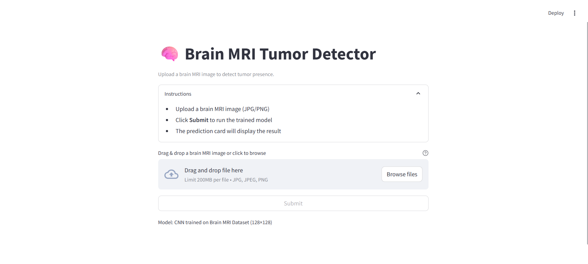
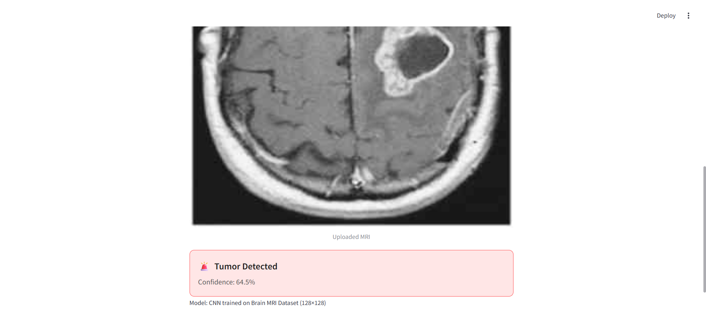
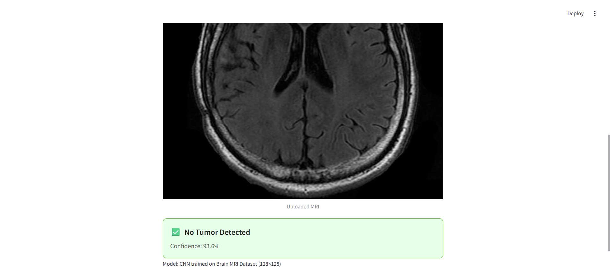

# 🧠 Brain Tumor Detection using CNN on MRI Scans

## Project Overview
- This project implements a Convolutional Neural Network (CNN) to detect brain tumors from MRI scans. Built with PyTorch, the model classifies MRI images into tumor and non-tumor categories.
The goal is to explore deep learning techniques for medical image classification and evaluate model performance using both a custom CNN and (in future work) transfer learning approaches.
---

## Features
- Custom CNN architecture for brain MRI classification.
- Preprocessing pipeline including image normalization and resizing.
- Data balancing techniques (limited augmentation and resampling to handle class imbalance).
- Train/validation/test split with PyTorch DataLoader.
- Model training with loss monitoring, accuracy metrics, and visualization of learning curves.
- Exported trained model for inference.
- Streamlit web app for user-friendly tumor detection.

---

## Dataset
- Brain MRI Images for Brain Tumor Detection (Kaggle) ([Source](https://www.kaggle.com/datasets/navoneel/brain-mri-images-for-brain-tumor-detection/data))
- Classes:
  - `Tumor`
  - `No Tumor`

---

## Installation
1. Clone the repository:
```bash
git clone git@github.com:Baya-Mezghani/Brain-MRI-Tumor-Detection-.git
cd brain-tumor-detection-
```
2. Create a virtual environment and install dependencies:
```bash
python -m venv venv
source venv/bin/activate  
pip install -r requirements1.txt
```

---


## Usage
Run Streamlit App 
```bash
streamlit run streamlit_app.py
```
---

## Results

### Model Performance
- Accuracy: 0.84 
- Comments: This baseline CNN achieved 0.84 accuracy with limited data augmentation. Current work focuses on improving the model architecture, tuning hyperparameters, and experimenting with regularization techniques. Future comparisons will include transfer learning using pre-trained networks.
---

### Example Predictions

**Streamlit Interface Screenshot:**  


**Sample Predictions:**

| MRI Image | Model Prediction |
|-----------|----------------|
|  | Tumor |
|  | No Tumor |

